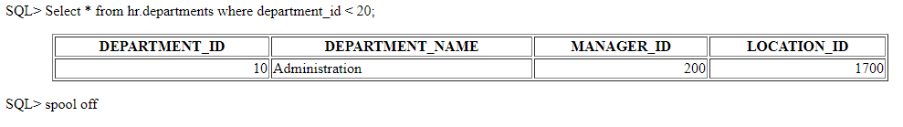

[//]: # (Copyright 2025 Jiaqi Liu. All rights reserved.)

[//]: # (Licensed under the Apache License, Version 2.0 &#40;the "License"&#41;;)
[//]: # (you may not use this file except in compliance with the License.)
[//]: # (You may obtain a copy of the License at)

[//]: # (    http://www.apache.org/licenses/LICENSE-2.0)

[//]: # (Unless required by applicable law or agreed to in writing, software)
[//]: # (distributed under the License is distributed on an "AS IS" BASIS,)
[//]: # (WITHOUT WARRANTIES OR CONDITIONS OF ANY KIND, either express or implied.)
[//]: # (See the License for the specific language governing permissions and)
[//]: # (limitations under the License.)

<!--truncate-->

Shell
-----

### Run Oracle SQL script and Exit Afterwards

```bash
exit | sqlplus -S $user/$pwd@//$server:$port/$service_name @script.sql
```

One example value of `$service_name` could be "ORCL". Note that there is a `@` symble preceding the script
path(`script.sql`)

### Shell Commands

#### Display UTF8

Whenever a client program (such as `sqlplus`) connects to the database, it tells the database what characterset it is
using. Some environments may have a very restricted characterset and use something like US7ASCII so they don't get
anything that can upset them.

As you can see in the following example, what is output by a query is dependent on the NLS_LANG setting of a client.

```shell
C:\>set NLS_LANG=.US7ASCII
C:\>sqlplus ???/???@xe

SQL*Plus: Release 10.2.0.1.0 - Production on Wed Nov 3 09:31:32 2010
> select chr(193) from dual;

C
-
?

> quit

C:\>set NLS_LANG=.AL32UTF8
C:\>sqlplus ???/???@xe

SQL*Plus: Release 10.2.0.1.0 - Production on Wed Nov 3 09:31:49 2010
> select chr(193) from dual;

C
-
┴
```

If your client is Windows, then try the above. If it is a unix(ish) platform, try

```bash
export NLS_LANG=.AL32UTF8
```

#### Spool SQL Query Output to HTML format in SQLPLUS Oracle

In SQLPLUS:

```sql
set pages 500
SET MARKUP HTML ON
spool report1.html
Select * from hr.departments where department_id < 20;
spool off
```

This would generate a "report1.html" file in the directory where SQLPLUS command was invoked and the file looks like
the following:



#### Show Tables

If you have worked with MySQL, you may be familiar with the `SHOW TABLES` command that lists all tables in a database:

```sql
SHOW TABLES;
```

Unfortunately, Oracle **does not** directly support the `SHOW TABLES` command. However, you can list all tables in a
database by querying from various data dictionary views.

##### Show Tables Owned By the Current User

To show tables **owned** by the current user, you query from the `user_tables` view.

```sql
SELECT table_name
FROM user_tables
ORDER BY table_name;
```

Note that this view does not show the `OWNER` column. Also, the user_tables table **does not** contain the other tables
that are **accessible** by the current user.

##### Show Tables Accessible By the Current User

To show all tables that are currently **accessible** by the current user, regardless of owners, you query from the
`all_tables` view:

```sql
SELECT table_name
FROM all_tables
ORDER BY table_name;
```

If you want to show all tables of a specific owner, you add the `OWNER` column in the `WHERE` clause as shown in the
following query:

```sql
SELECT *
FROM all_tables
WHERE OWNER = 'OT'
ORDER BY table_name;
```

##### Show All Tables in the Oracle Database

To show **all tables** in the entire Oracle Database, you query from the `dba_tables` view as follows:

```sql
SELECT table_name
FROM dba_tables;
```

You will get the following error message if you don't have access to the `dba_tables` view:

```bash
ORA-00942: table or view does not exist
```

In this case, you should request your database administrator to grant your account either privileges on the `dba_tables`
view, or `SELECT ANY DICTIONARY` privilege, or `SELECT_CATALOG_ROLE` privilege.

#### [Comparing Dates](https://stackoverflow.com/a/34061999)

```sql
Select count(*) From Employee
Where to_char(employee_date_hired, 'YYYMMMDDD') > 19940620
```

or

```sql
Select count(*) From Employee
employee_date_hired > TO_DATE('20-06-1994', 'DD-MM-YYYY');
```

#### [Show Last Command Run](https://stackoverflow.com/a/51193086)

The 'l' command will show the last run command

```sql
SQL> l
    1* select owner, count(1) from dba_tables group by owner
SQL>
```

To get more than that, turn on history

```sql
SQL> set history on
SQL> history
  1  select * from dual;
  2  select sysdate from dual;
  3  show history
```

#### [Get A List of All Tables](https://stackoverflow.com/a/205746)

```sql
SELECT OWNER, TABLE_NAME
FROM DBA_TABLES;
```

This is assuming that you have access to the `DBA_TABLES` data dictionary view. If you do not have those privileges but
need them, you can request that the DBA explicitly grants you privileges on that table, or, that the DBA grants you the
`SELECT ANY DICTIONARY` privilege or the `SELECT_CATALOG_ROLE` role (either of which would allow you to query any data
dictionary table). Of course, you may want to exclude certain schemas like `SYS` and `SYSTEM` which have large numbers
of Oracle tables that you probably don't care about.

Alternatively, if you do not have access to `DBA_TABLES`, you can see all the tables that your account has access to
through the `ALL_TABLES` view:

```sql
SELECT OWNER, TABLE_NAME
FROM ALL_TABLES;
```

Although, that may be a subset of the tables available in the database (`ALL_TABLES` shows you the information for all
the tables that your user has been granted access to).

If you are only concerned with the tables that you own, not those that you have access to, you could use `USER_TABLES`:

```sql
SELECT TABLE_NAME
FROM USER_TABLES;
```

Since `USER_TABLES` only has information about the tables that you own, it does not have an `OWNER` column - the owner,
by definition, is you.

Oracle also has a number of legacy data dictionary views -- `TAB`, `DICT`, `TABS`, and `CAT` for example -- that could
be used. In general, I would not suggest using these legacy views unless you absolutely need to backport your scripts to
Oracle 6. Oracle has not changed these views in a long time so they often have problems with newer types of objects. For
example, the `TAB` and `CAT` views both show information about tables that are in the user's recycle bin while the
`[DBA|ALL|USER]_TABLES` views all filter those out. `CAT` also shows information about materialized view logs with a
`TABLE_TYPE` of "TABLE" which is unlikely to be what you really want. `DICT` combines tables and synonyms and doesn't
tell you who owns the object.

Scripting
---------

### WHENEVER SQLERROR

When you have a script that has syntax errors, the script won't exit with error while executing the line that has the
syntax error. We would like to, instead, halt the execution at that point for the script tuning purposes. To do that
`WHENEVER SQLERROR` could be used.

The commands in the following script cause SQL*Plus to exit and return the SQL error code if the SQL UPDATE command
fails:

```sql
WHENEVER SQLERROR EXIT SQL.SQLCODE
UPDATE EMP_DETAILS_VIEW SET SALARY = SALARY*1.1;
```

### Drop All User Tables

```sql
BEGIN
   FOR cur_rec IN (SELECT object_name, object_type
                   FROM user_objects
                   WHERE object_type IN
                             ('TABLE',
                              'VIEW',
                              'MATERIALIZED VIEW',
                              'PACKAGE',
                              'PROCEDURE',
                              'FUNCTION',
                              'SEQUENCE',
                              'SYNONYM',
                              'PACKAGE BODY'
                             ))
   LOOP
      BEGIN
         IF cur_rec.object_type = 'TABLE'
         THEN
            EXECUTE IMMEDIATE 'DROP '
                              || cur_rec.object_type
                              || ' "'
                              || cur_rec.object_name
                              || '" CASCADE CONSTRAINTS';
         ELSE
            EXECUTE IMMEDIATE 'DROP '
                              || cur_rec.object_type
                              || ' "'
                              || cur_rec.object_name
                              || '"';
         END IF;
      EXCEPTION
         WHEN OTHERS
         THEN
            DBMS_OUTPUT.put_line ('FAILED: DROP '
                                  || cur_rec.object_type
                                  || ' "'
                                  || cur_rec.object_name
                                  || '"'
                                 );
      END;
   END LOOP;
   FOR cur_rec IN (SELECT *
                   FROM all_synonyms
                   WHERE table_owner IN (SELECT USER FROM dual))
   LOOP
      BEGIN
         EXECUTE IMMEDIATE 'DROP PUBLIC SYNONYM ' || cur_rec.synonym_name;
      END;
   END LOOP;
END;
/
```

Troubleshooting
---------------

### Double Quotes v.s. Single Quotes

Unlike MySQL which makes double and single quotes interchangeable.

### Oracle: ORA-00955: name is already used by an existing object

#### Cause 1

You probably have another object with the same name, for example, 'person'

You can find it by quering `person`:

```sql
SELECT * FROM user_objects WHERE object_name = 'person';
```

Then drop it (replace `TYPE_OF_OBJECT` by the type of the object from the above query):

```sql
DROP TYPE_OF_OBJECT person
```

#### Cause 2

You simply have a stupid `/` at the end of your statement, such as

```sql
CREATE TABLE some_schema.person (
    ...
);
/
```

Note the `/` at the end of the query statement

### ORA-02261: such unique or primary key already exists in the table

You simply have a stupid `/` at the end of your statement, such as

```sql
CREATE TABLE BRANCH(
BRA_CODE NUMBER NOT NULL PRIMARY KEY,
BRA_NAME VARCHAR(15),
BRA_ADDR VARCHAR(30),
 CITY_ID NUMBER);

ALTER TABLE BRANCH ADD CONSTRAINT UNIQUE_BRANCH_NAME UNIQUE (BRA_NAME);
\
```

Note the `/` at the end of the query statement

### Change varchar Column to CLOB

Given that the operation of moving from a varchar column to a CLOB is disallowed, the most straightforward way would be
to create a new column and move the data from the old column to the new column:

```sql
ALTER TABLE atable ADD (tmpdetails  CLOB);
UPDATE atable SET tmpdetails=details;
COMMIT;
ALTER TABLE atable DROP COLUMN details;
ALTER TABLE atable RENAME COLUMN tmpdetails TO details;
```
