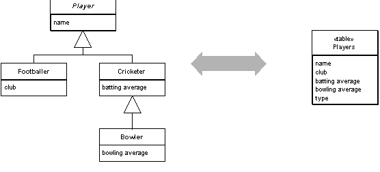
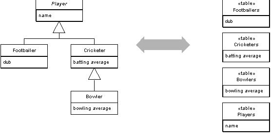
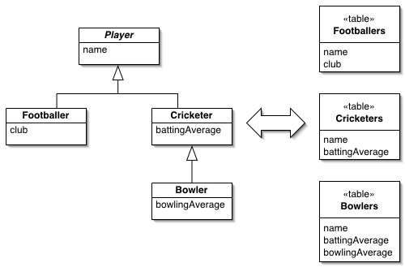

[//]: # (Copyright Jiaqi Liu)

[//]: # (Licensed under the Apache License, Version 2.0 &#40;the "License"&#41;;)
[//]: # (you may not use this file except in compliance with the License.)
[//]: # (You may obtain a copy of the License at)

[//]: # (    http://www.apache.org/licenses/LICENSE-2.0)

[//]: # (Unless required by applicable law or agreed to in writing, software)
[//]: # (distributed under the License is distributed on an "AS IS" BASIS,)
[//]: # (WITHOUT WARRANTIES OR CONDITIONS OF ANY KIND, either express or implied.)
[//]: # (See the License for the specific language governing permissions and)
[//]: # (limitations under the License.)

<!--truncate-->

[Single Table Inheritance](http://www.martinfowler.com/eaaCatalog/singleTableInheritance.html)
--------------------------

**Represents an inheritance hierarchy of classes as a single table that has columns for all the fields of the various
classes**.

For a full description see _Patterns of Enterprise Application Architecture - Martin Fowler (The Addison-Wesley
Signature Series)_ page 278

Relational databases don't support inheritance, so when mapping from objects to databases we have to consider how to
represent our nice inheritance structures in relational tables. When mapping to a relational database, we try to
minimize the joins that can quickly mount up when processing an inheritance structure in multiple tables. Single Table
Inheritance maps all fields of all classes of an inheritance structure into a single table.

[Class Table Inheritance](http://www.martinfowler.com/eaaCatalog/classTableInheritance.html)
-------------------------

**Represents an inheritance hierarchy of classes with one table for each class**.

For a full description see _Patterns of Enterprise Application Architecture - Martin Fowler (The Addison-Wesley
Signature Series)_ page 285

A very visible aspect of the object-relational mismatch is the fact that relational databases don't support inheritance.
You want database structures that map clearly to the objects and allow links anywhere in the inheritance structure.
Class Table Inheritance supports this by using one database table per class in the inheritance structure.

[Concrete Table Inheritance](http://www.martinfowler.com/eaaCatalog/concreteTableInheritance.html)
----------------------------

**Represents an inheritance hierarchy of classes with one table per concrete class in the hierarchy**.

For a full description see _Patterns of Enterprise Application Architecture - Martin Fowler (The Addison-Wesley
Signature Series)_ page 293

As any object purist will tell you, relational databases don't support inheritance - a fact that complicates
object-relational mapping. Thinking of tables from an object instance point of view, a sensible route is to take each
object in memory and map it to a single database row. This implies Concrete Table Inheritance, where there's a table for
each concrete class in the inheritance hierarchy.
