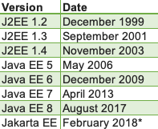

[//]: # (Copyright 2025 Jiaqi Liu)

[//]: # (Licensed under the Apache License, Version 2.0 &#40;the "License"&#41;;)
[//]: # (you may not use this file except in compliance with the License.)
[//]: # (You may obtain a copy of the License at)

[//]: # (    http://www.apache.org/licenses/LICENSE-2.0)

[//]: # (Unless required by applicable law or agreed to in writing, software)
[//]: # (distributed under the License is distributed on an "AS IS" BASIS,)
[//]: # (WITHOUT WARRANTIES OR CONDITIONS OF ANY KIND, either express or implied.)
[//]: # (See the License for the specific language governing permissions and)
[//]: # (limitations under the License.)

[Java EE](https://www.oracle.com/java/technologies/java-ee-glance.html) is a collection of specifications for developing
and deploying enterprise applications.

In general, enterprise applications refer to software hosted on servers that provide the applications that support the
enterprise.

The specifications (defined by Sun) describe services, application programming interfaces (APIs), and protocols.

The Java EE product provider is typically an application-server, web-server, or database-system vendor who provides
classes that implement the interfaces defined in the specifications. These vendors compete on implementations of the
Java EE specifications.

When a company requires Java EE experience what are they really asking for is experience using the technologies that
make up Java EE. Frequently, a company will only be using a subset of the Java EE technologies.

A reference implementation of Java EE is [GlassFish](https://javaee.github.io/glassfish/documentation)

<!--truncate-->

Evolution of Java EE
--------------------

Ever heard of Java EE? How about Java 2EE, J2EE, or now Jakarta EE? Actually, these are all different names for the same
thing: a set of enterprise specifications that extend Java SE. In this section, we discuss the evolution of Java EE.

### History

In the first version of Java, Java enterprise extensions were simply
[a part of the core JDK](http://titanium.cs.berkeley.edu/doc/java-langspec-1.0/).

Then, as part of Java 2 in 1999, these extensions were broken out of the standard binaries, and J2EE, or
[Java 2 Platform Enterprise Edition](https://www.oracle.com/java/technologies/appmodel.html), was born. It would keep
that name until 2006.

For Java 5 in 2006, J2EE was renamed to Java EE or Java Platform Enterprise Edition. That name would stick all the way
to September 2017, when **something major happened**.

**In September 2017,
[Oracle decided to give away the rights for Java EE to the Eclipse Foundation](https://www.redhat.com/en/blog/java-ee-moves-eclipse)
(the language is still owned by Oracle)**.

### In Transition

Actually, the Eclipse Foundation legally _had to_ rename Java EE. That's because Oracle has the rights over the "Java"
brand.

So to choose the new name, the community voted and picked: **Jakarta EE**. In a certain way, it's still JEE.

This is still an evolving story, though, and the dust hasn't completely settled. For example, while Oracle open-sourced
the source code, they did not open-source all the documentation. There's still a lot of discussion over this matter
because of legal issues that make it tricky to open-source documentation related to, for example, JMS and EJB.

It's not clear yet if new Eclipse Foundation documentation will be able to refer to the originals.

Also, curiously, the Eclipse Foundation can't create any new Java packages using the javax namespace, but it can create
new classes and subclasses under the existing ones.

The transition also means [a new process for adding specifications](https://www.eclipse.org/projects/efsp/) to Jakarta
EE. To understand it better, let's take a look at what that process was like under Oracle and how it changes under the
Eclipse Foundation in the next section.

### The Future

Historically, in order for a feature to make it into "EE", we needed three things:

1. a specification,
2. a reference implementation, and
3. tests

These three things could be provided by anyone in the community, and an Executive Committee would decide when these were
ready to add to the language.

To better understand the past process, let's take a closer look at what JSRs(specification), Glassfish(implementation),
and the TCK(test) are and how they embodied new EE features.

### The JCP -> EFSP

In the past, the process by which a new EE feature was born was called the Java Community Process
([JCP](https://jcp.org/en/home/index)).

Java SE still uses the JCP today. But, since EE has changed its ownership, from Oracle to the Eclipse Foundation, we
have a new and separate process for that. It's the Eclipse Foundation Specification Process
([EFSP](https://www.eclipse.org/projects/efsp/)) and it's an extension of the
[Eclipse Development Process](https://www.eclipse.org/projects/dev_process).

There are
[some important differences](https://blogs.eclipse.org/post/tanja-obradovic/how-eclipse-foundation-specification-process-efsp-different-java-community),
though, mostly around "Transparency, Openness, Shared Burden and Vendor Neutrality"". The EFSP organizers, for example,
envision collaborative working groups that are vendor-neutral, a certification process that is self-service, and an
organization that operates and governs as a meritocracy.

### JSRs

In the JCP, the first step to adding a feature to EE was to create a JSR or Java Specification Request. The JSR was a
bit like the interface for an EE feature. The JCP Executive Committee reviewed and approved a completed JSR, and then
JSR contributors would code it up and make it available to the community.

A good example of this was [JSR-339](https://jcp.org/en/jsr/detail?id=339)  - or JAX-RS - which was originally proposed
in 2011, approved by JCP in 2012 and finally released in 2013.

And while the community could always weigh in while a specification was under discussion, time showed that an
implementation-first approach – like in the case of [JSR 310](https://jcp.org/en/jsr/detail?id=310), `java.time`, and
Joda Time - tended to create more widely-accepted features and APIs.

So, the EFSP reflects this code-first view in its stated goal: "EFSP will be based on hands-on experimenting and coding
first, as a way to prove something is worthy of documenting in a specification".

### Glassfish

Then, as part of the JCP, a JSR needed a reference implementation. This is a bit like the class that implements the
interface. A reference implementation helps developers of compatible libraries or other organizations that want to
create their own implementation of the spec.

For Java EE features, the JCP used Glassfish for its reference implementations.

And while this centralization on Glassfish simplified the discovery process for implementers, that centralization also
required more governance and had a tendency to favor one vendor over another.

Hence, the EFSP doesn't require a reference implementation, but instead only a compatible implementation. Simply put,
this subtle change makes so that **implementations inside of a central architecture, like Glassfish, won't be
inadvertently preferred by the foundation**.

### TCK

Finally, the JCP required that EE features be tested through the Technology Compatibility Kit, or
[TCK](https://projects.eclipse.org/projects/ee4j.jakartaee-tck).

The TCK was a suite of tests to validate a specific EE JSR. Simply put, in order to comply with Java EE, an application
server needs to implement all of its JSRs and pass all the tests on the designated TCK.

Not much changes here. Oracle open-sourced the TCK as well as the EE JSRs. Of course, all future documents and the TCK
will be open-source.
