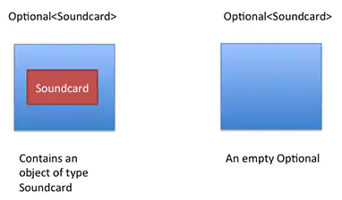

[//]: # (Copyright 2025 Jiaqi Liu. All rights reserved.)

[//]: # (Licensed under the Apache License, Version 2.0 &#40;the "License"&#41;;)
[//]: # (you may not use this file except in compliance with the License.)
[//]: # (You may obtain a copy of the License at)

[//]: # (    http://www.apache.org/licenses/LICENSE-2.0)

[//]: # (Unless required by applicable law or agreed to in writing, software)
[//]: # (distributed under the License is distributed on an "AS IS" BASIS,)
[//]: # (WITHOUT WARRANTIES OR CONDITIONS OF ANY KIND, either express or implied.)
[//]: # (See the License for the specific language governing permissions and)
[//]: # (limitations under the License.)

Make your code more readable and protect it against null pointer exceptions.

<!--truncate-->

A wise man once said you are not a real Java programmer until you've dealt with a null pointer exception. Joking aside,
the null reference is the source of many problems because it is often used to denote the absence of a value. Java SE 8
introduces a new class called **java.util.Optional** that can alleviate some of these problems.

Dangers of Null
---------------

Let's start with an example to see the dangers of null by considering a nested object structure for a `Computer`, as
illustrated in Figure below


What's possibly problematic with the following code?

```java
String version = computer.getSoundcard().getUSB().getVersion();
```

This code looks pretty reasonable. However, many computers (for example, the Raspberry Pi) don't actually ship with a
sound card. So what is the result of `getSoundcard()`?

A common (bad) practice is to return the null reference to indicate the absence of a sound card. Unfortunately, this
means the call to `getUSB()` will try to return the USB port of a null reference, which will result in a
`NullPointerException` at runtime and stop your program from running further. Imagine if your program was running on a
customer's machine; what would your customer say if the program suddenly failed?

To give some historical context, Tony Hoare - one of the giants of computer science - wrote, "I call it my
billion-dollar mistake. It was the invention of the null reference in 1965. I couldn't resist the temptation to put in
a null reference, simply because it was so easy to implement."

What can you do to prevent unintended null pointer exceptions? You can be defensive and add checks to prevent null
dereferences, as shown below:

```java
String version = "UNKNOWN";
if (computer != null) {
    Soundcard soundcard = computer.getSoundcard();
    if(soundcard != null){
        USB usb = soundcard.getUSB();
        if(usb != null){
            version = usb.getVersion();
        }
    }
}
```

However, you can see that the code quickly becomes very ugly due to the nested checks. Unfortunately, we need a lot of
boilerplate code to make sure we don't get a NullPointerException. In addition, it's just annoying that these checks get
in the way of the business logic. In fact, they are decreasing the overall readability of our program.

Furthermore, it is an error-prone process; what if you forget to check that one property could be null? I will argue in
this post that using null to represent the absence of a value is a wrong approach. What we need is a better way to
model the absence and presence of a value.

To give some context, let's briefly look at what other programming languages have to offer.

What Alternatives to Null Are There
-----------------------------------

Languages such as Groovy have a _safe navigation operator_ represented by "?." to safely navigate through potential
null references. (Note that it is soon to be included in C#, too, and it was proposed for Java SE 7 but didn't make it
into that release.) It works as follows:

```groovy
String version = computer?.getSoundcard()?.getUSB()?.getVersion()
```

In this case, the variable "version" will be assigned to null if `computer` is null, or `getSoundcard()` returns null,
or `getUSB()` returns null. You don't need to write complex nested conditions to check for null.

In addition, Groovy also includes the _Elvis operator_ "?:" (if you look at it sideways, you'll recognize Elvis' famous
hair), which can be used for simple cases when a default value is needed. In the following, if the expression that uses
the safe navigation operator returns null, the default value "UNKNOWN" is returned; otherwise, the available version
tag is returned.

```groovy
String version = computer?.getSoundcard()?.getUSB()?.getVersion() ?: "UNKNOWN"
```

Other functional languages, such as Haskell and Scala, take a different view. Haskell includes a **Maybe** type, which
essentially encapsulates an optional value. A value of type Maybe can contain either a value of a given type or
nothing. There is no concept of a null reference. Scala has a similar construct called **Option\[T\]** to encapsulate
the presence or absence of a value of type `T`. You then have to explicitly check whether a value is present or not
using operations available on the `Option` type, which enforces the idea of "null checking." **You can no longer
"forget to do it" because it is enforced by the type system**.

Java 8 _Optional_ in a Nutshell
-------------------------------

Java SE 8 introduces a new class called `java.util.Optional<T>` that is inspired from the ideas of Haskell and Scala.
It is a class that encapsulates an optional value, as illustrated in figure below. You can view `Optional` as a
single-value container that either contains a value or doesn't (it is then said to be "empty"):



We can update our model to make use of Optional, as shown in Listing 2:

```java
public class Computer {
    private Optional<Soundcard> soundcard;
    public Optional<Soundcard> getSoundcard() { ... }
    ...
}

public class Soundcard {
    private Optional<USB> usb;
    public Optional<USB> getUSB() { ... }
}

public class USB {
    public String getVersion(){ ... }
}
```

The code above immediately shows that a computer might or might not have a sound card (the sound card is optional). In
addition, a sound card can optionally have a USB port. This is an improvement, because this new model can now reflect
clearly whether a given value is allowed to be missing.

But what can you actually do with an `Optional<Soundcard>` object? After all, you want to get to the USB port's version
number. In a nutshell, the `Optional` class includes methods to explicitly deal with the cases where a value is present
or absent. However, the advantage compared to null references is that the `Optional` class forces us to think about the
case when the value is not present. As a consequence, we can prevent unintended null pointer exceptions.

It is important to note that the intention of the `Optional` class is not to replace every single null reference.
Instead, its purpose is to help design more-comprehensible APIs so that by just reading the signature of a method, you
can tell whether you can expect an optional value. This forces you to actively unwrap an `Optional` to deal with the
absence of a value.

Using Optional
--------------

The Groovy code above can be written with Optional in Java as

```java
String name = computer.flatMap(Computer::getSoundcard)
        .flatMap(Soundcard::getUSB)
        .map(USB::getVersion)
        .orElse("UNKNOWN");
```

### Creating Optional Objects

First, how do you create Optional objects? There are several ways:

Here is an empty Optional:

```java
Optional<Soundcard> sc = Optional.empty();
```

And here is an `Optional` with a non-null value:

```java
Optional<Soundcard> sc = Optional.of(new Soundcard());
```

In the case above, if soundcard were null, a NullPointerException would be immediately thrown (rather than getting a
latent error once you try to access properties of the soundcard)

By using **ofNullable**, however, you can create an Optional object that may hold a null value:

```java
Optional<Soundcard> sc = Optional.ofNullable(soundcard);
```

If soundcard were null, the resulting `Optional` object would be empty.

### Do Something If a Value Is Present

Now that you have an Optional object, you can access the methods available to explicitly deal with the presence or
absence of values. Instead of having to remember to do a null check, as follows:

```java
SoundCard soundcard = ...;
if(soundcard != null){
    System.out.println(soundcard);
}
```

You can use the **ifPresent()** method, as follows:

```java
Optional<Soundcard> soundcard = ...;
soundcard.ifPresent(System.out::println);
```

You no longer need to do an explicit null check; it is enforced by the type system. If the Optional object were empty,
nothing would be printed.

You can also use the **isPresent()** method to find out whether a value is present in an Optional object. In addition,
there's a **get()** method that returns the value contained in the Optional object, if it is present. _Otherwise,
it throws a NoSuchElementException_. The two methods can be combined, as follows, to prevent exceptions:

```java
if(soundcard.isPresent()){
    System.out.println(soundcard.get());
}
```

However, this is not the recommended use of Optional because it's not much of an improvement over nested null checks,
and there are more idiomatic alternatives, which we explore below.

### Default Values and Actions

A typical pattern is to return a default value if you determine that the result of an operation is null. In general,
you can use the ternary operator, as follows, to achieve this:

```java
Soundcard soundcard = maybeSoundcard != null ? maybeSoundcard : new Soundcard("basic_sound_card");
```

Using an Optional object, you can rewrite this code by using the **orElse()** method, which provides a default value if
Optional is empty:

```java
Soundcard soundcard = maybeSoundcard.orElse(new Soundcard("defaut"));
```

Similarly, you can use the **orElseThrow()** method, which instead of providing a default value if Optional is empty,
throws an exception:

```java
Soundcard soundcard = maybeSoundCard.orElseThrow(IllegalStateException::new);
```

### Rejecting Certain Values Using the filter Method

Often you need to call a method on an object and check some property. For example, you might need to check whether the
USB port is a particular version. To do this in a safe way, you first need to check whether the reference pointing to a
USB object is null and then call the `getVersion()` method, as follows:

```java
USB usb = ...;
if(usb != null && "3.0".equals(usb.getVersion())){
    System.out.println("ok");
}
```

This pattern can be rewritten using the **filter** method on an Optional object, as follows:

```java
Optional<USB> maybeUSB = ...;
maybeUSB.filter(usb -> "3.0".equals(usb.getVersion()).ifPresent(() -> System.out.println("ok"));
```

The `filter` method takes a predicate as an argument. If a value is present in the `Optional` object and it matches the
predicate, the filter method returns that value; otherwise, it returns an empty `Optional` object.

### Extracting and Transforming Values Using the map Method

Another common pattern is to extract information from an object. For example, from a `Soundcard` object, you might want
to extract the USB object and then further check whether it is of the correct version. You would typically write the
following code:

```java
if(soundcard != null){
    USB usb = soundcard.getUSB();
    if(usb != null && "3.0".equals(usb.getVersion()){
        System.out.println("ok");
    }
}
```

We can rewrite this pattern of "checking for null and extracting" (here, the `Soundcard` object) using the map method.

```java
Optional<USB> usb = maybeSoundcard.map(Soundcard::getUSB);
```

There's a direct parallel to the `map` method used with streams. There, you pass a function to the `map` method, which
applies this function to each element of a stream. However, nothing happens if the stream is empty. The `map` method of
the `Optional` class does exactly the same: the value contained inside `Optional` is "transformed" by the function
passed as an argument (here, a method reference to extract the USB port), while nothing happens if `Optional` is empty.

Finally, we can combine the `map` method with the `filter` method to reject a USB port whose version is different than
3.0:

```java
maybeSoundcard.map(Soundcard::getUSB)
        .filter(usb -> "3.0".equals(usb.getVersion())
        .ifPresent(() -> System.out.println("ok"));
```

### Cascading Optional Objects Using the flatMap Method

We've seen a few patterns that can be refactored to use Optional. So how can we write the following code in a safe way?

```java
String version = computer.getSoundcard().getUSB().getVersion();
```

Notice that all this code does is extract one object from another one, which is exactly what the map method is for.
Earlier in the article, we changed our model so a Computer has an `Optional<Soundcard>` and a Soundcard has an
`Optional<USB>`, so we should be able to write the following:

```java
String version = computer.map(Computer::getSoundcard)
        .map(Soundcard::getUSB)
        .map(USB::getVersion)
        .orElse("UNKNOWN");
```

Unfortunately, this code doesn't compile. Why? The variable computer is of type `Optional<Computer>`, so it is
perfectly correct to call the `map` method. However, `getSoundcard()` returns an object of type `Optional<Soundcard>`.
This means the result of the `map` operation is an object of type `Optional<Optional<Soundcard>>`. As a result, the
call to `getUSB()` is invalid because the outermost Optional contains as its value another Optional, which of course
doesn't support the `getUSB()` method

So how can we solve this problem? Again, we can look at a pattern you might have used previously with streams: the
**flatMap** method. With streams, the `flatMap` method takes a function as an argument, which returns another stream.
This function is applied to each element of a stream, which would result in a stream of streams. However, `flatMap` has
the effect of replacing each generated stream by the contents of that stream. In other words, all the separate streams
that are generated by the function get amalgamated or "flattened" into one single stream. What we want here is
something similar, but we want to "flatten" a two-level Optional into one.

Well, here's good news: `Optional` also supports a `flatMap` method. Its purpose is to apply the transformation
function on the value of an `Optional` and then flatten the resulting two-level Optional into a single one.

So, to make our code correct, we need to rewrite it as follows using `flatMap`:

```java
String version = computer.flatMap(Computer::getSoundcard)
        .flatMap(Soundcard::getUSB)
        .map(USB::getVersion)
        .orElse("UNKNOWN");
```

The first flatMap ensures that an `Optional<Soundcard>` is returned instead of an `Optional<Optional<Soundcard>>`, and
the second flatMap achieves the same purpose to return an `Optional<USB>`. Note that the third call just needs to be a
map() because getVersion() returns a String rather than an `Optional` object.
