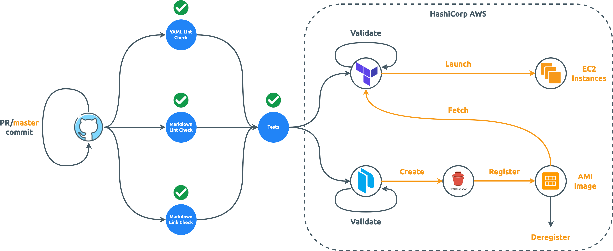

The following [GitHub Secrets][How to set up GitHub Action Secrets] needs to be defined

- [**SONAR_TOKEN**](https://sonarcloud.io/project/overview?id=QubitPi_jersey-ws-template)
- (Optional) **SSL_CERTIFICATE** SSL certificate file content (for
  [exposing webservice endpoints over HTTPS][Nginx SSL Config])
- (Optional) **SSL_CERTIFICATE_KEY** SSL certificate key file content (for
  [exposing webservice endpoints over HTTPS][Nginx SSL Config])

  :::info

  In case SSL is not needed (because, for example, the webservice is behind a load balancer, which handles SSL for it),
  Delete the following:

  - SSL config in HashiCorp [image][HashiCorp Packer template] and its
    [setup script][HashiCorp Packer template setup script]
  - [AWS Route 53 record config][HashiCorp Terraform config file]

  :::

- [**AWS_ACCESS_KEY_ID**](https://docs.aws.amazon.com/cli/latest/userguide/cli-configure-envvars.html)
- [**AWS_SECRET_ACCESS_KEY**](https://docs.aws.amazon.com/cli/latest/userguide/cli-configure-envvars.html)
- [**AWS_REGION**](https://docs.aws.amazon.com/cli/latest/userguide/cli-configure-envvars.html), such as "us-east-1"
- (Optional) **ZONE_ID** AWS Route 53 hosted zone ID (DNS routing) **if SSL configs above are set**
- **DOCKERHUB_USERNAME** The [Dockerfile][jersey-ws-template Dockerfile], in [CI/CD][jersey-ws-template CI/CD], got
  pushed to a [personal DockerHub][docker hub] account. The _DOCKERHUB_USERNAME_ if it needs to go to a different
  account, should be set accordingly
- [**DOCKERHUB_TOKEN**](https://docs.docker.com/docker-hub/access-tokens/) for pushing the
  [aforementioned image][jersey-ws-template Dockerfile]
<!-- markdown-link-check-disable -->

- [**SENTRY_DSN**](sentry)

<!-- markdown-link-check-enable -->

- Update `"EC2 Instance Name"` and `"Security Group Name"` in [Terraform config file][HashiCorp Terraform config file]
  accordingly

[docker hub]: https://hub.docker.com/r/jack20191124/jersey-ws-template/

[HashiCorp Packer template]: https://github.com/QubitPi/jersey-ws-template/blob/master/hashicorp/images/aws-jersey-ws.pkr.hcl
[HashiCorp Packer template setup script]: https://github.com/QubitPi/jersey-ws-template/blob/master/hashicorp/scripts/setup.sh
[HashiCorp Terraform config file]: https://github.com/QubitPi/jersey-ws-template/blob/master/hashicorp/instances/main.tf

[jersey-ws-template CI/CD]: https://github.com/QubitPi/jersey-ws-template/blob/master/.github/workflows/ci-cd.yml
[jersey-ws-template Dockerfile]: https://github.com/QubitPi/jersey-ws-template/blob/master/Dockerfile

[Nginx SSL Config]: https://github.com/QubitPi/jersey-ws-template/blob/master/hashicorp/images/nginx-ssl.conf
