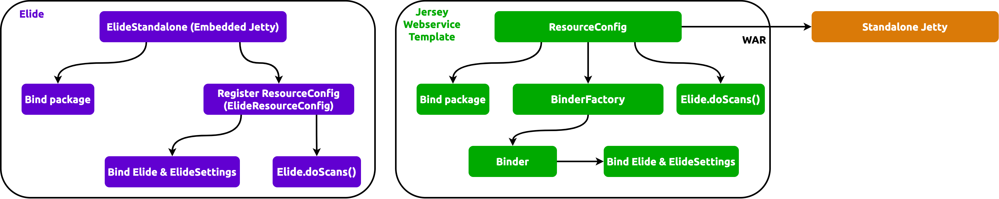

[Jersey Webservice Template] (_JWT_) delegates JPA capabilities to [Elide] and configures Elide through 2 required
Elide [bindings][what is binding]:

1. **[Elide][Elide instance class]**
2. **[ElideSettings][ElideSettings instance class]** with 2 extra sub-bindings:

   - **EntityDictionary**
   - **DataStore**

The binding is referencing [Elide Standalone] in the following way:

:::danger

Although the Jersey binder wraps HK2 binder, we
[must pick the _Jersey binder_ for binding Elide resources](https://github.com/QubitPi/jersey-webservice-template/pull/29/files#diff-afa024cc2643aaf681db505cac24b8601c94931290718993392e7726001b1559L39-R40),
otherwise, dependency injection will flaky and not right.

:::



Running Webservice in Docker Compose
------------------------------------

### Step 1: Defining Data Models

To inject [Elide model package](https://github.com/yahoo/elide/tree/master/elide-standalone#create-models), simply put
the models in a separate JAR and include it as a dependency in POM. If the model package is internal and cannot be
visible publicly, either make the astraios project private or public with model package dependency info
[injected via settings.xml](https://maven.apache.org/examples/injecting-properties-via-settings.html), for example:

```xml
<project>

    ...

    <dependencies>
        <dependency>
            <groupId>${astraios.model.package.jar.group.id}</groupId>
            <artifactId>${astraios.model.package.jar.artifact.id}</artifactId>
            <version>${astraios.model.package.jar.version}</version>
        </dependency>
    </dependencies>

    ...

    <repositories>
        <repository>
            <id>${astraios.model.package.repo.id}</id>
            <name>Astraios model pacakge JAR repository</name>
            <url>${astraios.model.package.repo.url}</url>
        </repository>
    </repositories>

    ...

</project>
```

with a corresponding `~/.m2/settings.xml`:

```xml
<settings xmlns="http://maven.apache.org/SETTINGS/1.0.0"
          xmlns:xsi="http://www.w3.org/2001/XMLSchema-instance"
          xsi:schemaLocation="http://maven.apache.org/SETTINGS/1.0.0
                      http://maven.apache.org/xsd/settings-1.0.0.xsd">

    <profiles>
        <profile>
            <id>astraios-config-properties</id>
            <properties>
                <astraios.model.package.jar.group.id>com.mycompnay</astraios.model.package.jar.group.id>
                <astraios.model.package.jar.artifact.id>my-model-package</astraios.model.package.jar.artifact.id>
                <astraios.model.package.jar.version>1.0.7</astraios.model.package.jar.version>
                <astraios.model.package.repo.id>mycompany-maven-repo-id</astraios.model.package.repo.id>
                <astraios.model.package.repo.url>
                    https://private.mvnrepository.com/artifact/com.company/my-model-package
                </astraios.model.package.repo.url>
            </properties>
        </profile>
    </profiles>


    <activeProfiles>
        <activeProfile>astraios-config-properties</activeProfile>
    </activeProfiles>

    <servers>
        ...
    </servers>
</settings>
```

Lastly, if IntelliJ IDE is used for developing Astraios, please make sure to let IDE pick up the `~/.m2/settings.xml` by
unchecking the _Use settings from .mvn/maven.config_:


### Step 2: Spinning Up Docker Compose

Jersey WS Template can run in [Docker Compose] for the following purposes

1. Decoupling frontend and backend developments
2. Making it easy to run E2E testing of Jersey WS Template-backed application in CI/CD

:::caution

Docker Compose designed here is intended for local development and testing purposes ONLY! _It is strongly discouraged
to run this Docker Compose in production!_

:::


Simply run:

```bash
git clone https://github.com/QubitPi/jersey-webservice-template.git
cd jersey-webservice-template
git checkout jpa-elide
mvn clean package
MODEL_PACKAGE_NAME=$JWT_MODEL_PACKAGE_NAME docker compose up --build --force-recreate
```

where `$JWT_MODEL_PACKAGE_NAME` is the package in config JAR that contains all
[elide models](https://elide.io/pages/guide/v7/02-data-model.html). It can be set, for example, at command line with:

```bash
export JWT_MODEL_PACKAGE_NAME=com.mycompany.jwt.models
```

:::info

JWT comes with a
[pre-build model](https://github.com/QubitPi/jersey-webservice-template/blob/jpa-elide/src/main/java/com/qubitpi/ws/jersey/template/models/Book.java)
that can be used with the [demo queries below](#graphql-queries-through-graphiql). Set JWT to use this model via

```bash
export JWT_MODEL_PACKAGE_NAME=com.qubitpi.ws.jersey.template.models
```

:::

The variable will be [passed](https://stackoverflow.com/a/58900415) into Docker Compose file.

### Troubleshooting

#### Database Does Not Have My Model Packages's Bean Table

_If tests is running in IntelliJ IDE_, make sure the model package JAR it is in IDE's **External Libraries**

Otherwise, the dependency injection didn't find a bean class under the package specified by
[JWT_MODEL_PACKAGE_NAME](#step-1-defining-data-models)

### Entity Missing Default Constructor

```bash
[main] INFO  o.h.m.i.EntityInstantiatorPojoStandard - HHH000182: No default (no-argument) constructor for
class: ... (class must be instantiated by Interceptor)
```

Simply add a no-args constructor to the bean class.

### How to Exclude GraphQL Feature

To optionally disable GraphQL endpoints, exclude corresponding dependencies in POM. For example:

```xml
        <dependency>
            <groupId>com.yahoo.elide</groupId>
            <artifactId>elide-core</artifactId>
            <version>7.0.0-pr6</version>
            <exclusions>
                <exclusion>
                    <groupId>com.yahoo.elide</groupId>
                    <artifactId>elide-graphql</artifactId>
                </exclusion>
            </exclusions>
        </dependency>
```

[Elide]: https://elide.io/
[Elide instance class]: https://github.com/yahoo/elide/blob/master/elide-core/src/main/java/com/yahoo/elide/Elide.java
[Elide Standalone]: https://github.com/yahoo/elide/tree/master/elide-standalone
[ElideSettings instance class]: https://github.com/yahoo/elide/blob/master/elide-core/src/main/java/com/yahoo/elide/ElideSettings.java

[Jersey Webservice Template]: https://qubitpi.github.io/jersey-webservice-template/

[what is binding]: https://qubitpi.github.io/jersey/ioc.html

GraphQL Queries through GraphiQL
--------------------------------

### Install GraphiQL (on Mac)

via [Homebrew](https://formulae.brew.sh/cask/graphiql)

```bash
brew install --cask graphiql
```

### Quering GraphQL Endpoint

Let's crete a book:

```graphql
mutation {
  book(op: UPSERT, data:{title: "Pride & Prejudice"}) {
    edges {
      node {
        id
        title
      }
    }
  }
}
```


We can create few more books, sort and paginate them with:

```graphql
{
  book(sort: "-id", first: "1", after: "0") {
    edges {
      node {
        id
        title
      }
    }
    pageInfo {
      totalRecords
      startCursor
      endCursor
      hasNextPage
    }
  }
}
```


