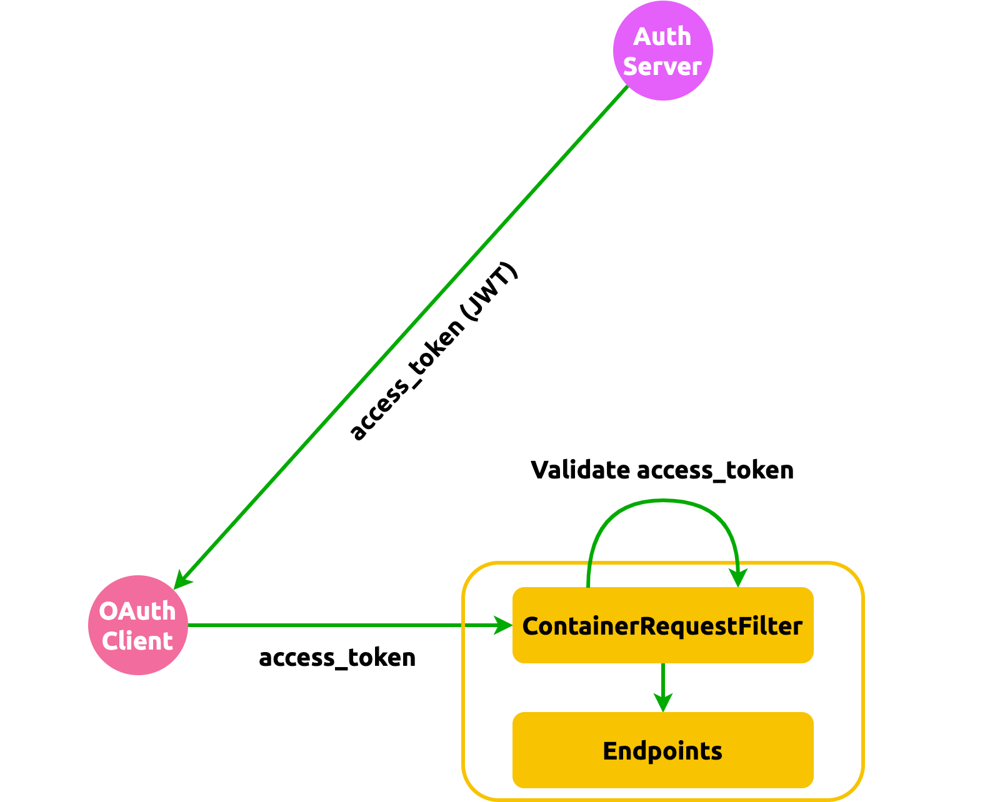

[//]: # (Copyright Jiaqi Liu)

[//]: # (Licensed under the Apache License, Version 2.0 &#40;the "License"&#41;;)
[//]: # (you may not use this file except in compliance with the License.)
[//]: # (You may obtain a copy of the License at)

[//]: # (    http://www.apache.org/licenses/LICENSE-2.0)

[//]: # (Unless required by applicable law or agreed to in writing, software)
[//]: # (distributed under the License is distributed on an "AS IS" BASIS,)
[//]: # (WITHOUT WARRANTIES OR CONDITIONS OF ANY KIND, either express or implied.)
[//]: # (See the License for the specific language governing permissions and)
[//]: # (limitations under the License.)

Core Concepts
-------------

API authentication is largely a solved problem and generally outside the scope of Jersey Webservice Template.

Jersey Webservice Template does, however, adds a layer of security on its own by validating [OAuth 2 access token] on
all incoming request. Each API request requires a standard `"Authentication": "Bearer <access_token>"` token header:

:::info

The validator can be turned on by setting **OAUTH_ENABLED** to _true_. There are 3 ways to do so (with the priority in
the following order):

1. Setting an OS environment variable using, for example, `export OAUTH_ENABLED=true`
2. Define a JVM system property by

   ```java
   System.setProperty("OAUTH_ENABLED", "true");
   ```

3. Putting an **oauth.properties** file under _src/main/resources_ directory with the following content

   ```properties
   OAUTH_ENABLED=true
   ```

In addition, JWKs URL needs to be set with **JWKS_URL** using the same approach above. The URL should display something
like the following

```json
{
    "keys": [
        {
            "kty": "EC",
            "use": "sig",
            "kid": "eTERknhur9q8gisdaf_dfrqrgdfsg",
            "alg": "ES384",
            "crv": "P-384",
            "x": "sdfrgHGYF...",
            "y": "sdfuUIG&8..."
        }
    ]
}
```

:::



To define a token validator, simply implement the **AccessTokenValidator** like so:

```java
public class JwtTokenValidator implements AccessTokenValidator {

    @Override
    public boolean validate(@NotNull final String accessToken) {
        // use https://github.com/auth0/java-jwt as recommended by https://jwt.io/
        return true;
    }
}
```

and bind the validator, in [BinderFactory], using

```java
bind(new JwtTokenValidator()).to(AccessTokenValidator.class);
```

For example, to validate a ES384 token using _AccessTokenValidator_, we may implement a _ES384JwtTokenValidator_
validator below:

:::note

Note that the implementation[^1] below depends on 2 JWT libraries:

```xml
<dependency>
    <groupId>com.auth0</groupId>
    <artifactId>java-jwt</artifactId>
    <version>4.4.0</version>
</dependency>
<dependency>
    <groupId>com.auth0</groupId>
    <artifactId>jwks-rsa</artifactId>
    <version>0.22.1</version>
</dependency>
```

:::

```java
import com.auth0.jwk.InvalidPublicKeyException;
import com.auth0.jwk.Jwk;
import com.auth0.jwk.JwkException;
import com.auth0.jwk.JwkProvider;
import com.auth0.jwk.JwkProviderBuilder;
import com.auth0.jwt.JWT;
import com.auth0.jwt.algorithms.Algorithm;
import com.auth0.jwt.interfaces.Verification;

import org.slf4j.Logger;
import org.slf4j.LoggerFactory;

import jakarta.validation.constraints.NotNull;
import net.jcip.annotations.Immutable;
import net.jcip.annotations.ThreadSafe;

import java.net.MalformedURLException;
import java.net.URL;
import java.security.interfaces.ECPublicKey;
import java.util.Objects;

/**
 * {@link ES384JwtTokenValidator} validates an <a href="https://jwt.io/">JWT</a> token in ES384 JWS form.
 *
 * It validates the access token by verifying the integrity of the header and payload to ensure that they have not been
 * altered by using token's signature section.
 */
@Immutable
@ThreadSafe
public class ES384JwtTokenValidator implements AccessTokenValidator {

    private static final Logger LOG = LoggerFactory.getLogger(ES384JwtTokenValidator.class);

    private final String jwksUrl;

    /**
     * Constructs a new {@link ES384JwtTokenValidator} that verfies the signed JWT token with the JWK keys stored at a
     * specified URL.
     *
     * @param jwksUrl  The provided JWKS URL that, on GET, returns a json object such as
     * <pre>
     * {@code
     * {
     *     "keys": [
     *         {
     *             "kty": "EC",
     *             "use": "sig",
     *             "kid": "eTERknhur9q8gisdaf_dfrqrgdfsg",
     *             "alg": "ES384",
     *             "crv": "P-384",
     *             "x": "sdfrgHGYF...",
     *             "y": "sdfuUIG&8..."
     *         }
     *     ]
     * }
     * }
     * </pre>
     *
     * @throws NullPointerException if {@code jwksUrl} is {@code null}
     */
    public ES384JwtTokenValidator(final String jwksUrl) {
        this.jwksUrl = Objects.requireNonNull(jwksUrl);
    }

    @Override
    public boolean validate(@NotNull final String accessToken) {
        final JwkProvider jwkProvider = getJwkProvider(getJwksUrl());
        final Jwk jwk = getJwk(jwkProvider, accessToken);
        final Algorithm algorithm = getVerificationAlgorithm(jwk);
        final Verification verifier = JWT.require(algorithm);

        verifier.build().verify(accessToken);

        return true;
    }

    /**
     * Returns a one-time built instance of {@link JwkProvider} to save performance.
     *
     * @param jwksUrl  The JWKS URL that, on GET, returns a json object such as
     * <pre>
     * {@code
     * {
     *     "keys": [
     *         {
     *             "kty": "EC",
     *             "use": "sig",
     *             "kid": "eTERknhur9q8gisdaf_dfrqrgdfsg",
     *             "alg": "ES384",
     *             "crv": "P-384",
     *             "x": "sdfrgHGYF...",
     *             "y": "sdfuUIG&8..."
     *         }
     *     ]
     * }
     * }
     * </pre>
     *
     * @return a new instance
     *
     * @throws IllegalStateException if the {@code jwksUrl} is an invalid URL
     */
    @NotNull
    private static JwkProvider getJwkProvider(@NotNull final String jwksUrl) {
        try {
            return new JwkProviderBuilder(new URL(jwksUrl)).build();
        } catch (final MalformedURLException exception) {
            final String message = String.format("Invalid JWKS URL: '%s'", jwksUrl);
            LOG.error(message, exception);
            throw new IllegalStateException(message, exception);
        }
    }

    /**
     * Returns a JWK key set that will be used to verify a given JWT access token.
     *
     * @param jwkProvider  An object that contains the JWK; cannot be {@code null}
     * @param accessToken  A "key" that indexes the JWK from the {@code jwkProvider}; cannot be {@code null}
     *
     * @return a JWK key set
     *
     * @throws IllegalStateException if no JWK set associated with the provided token is found from {@code jwkProvider}
     */
    private static Jwk getJwk(@NotNull final JwkProvider jwkProvider, @NotNull final String accessToken) {
        try {
            return jwkProvider.get(JWT.decode(accessToken).getKeyId());
        } catch (final JwkException exception) {
            final String message = "The key ID in the access token does not match any JWK";
            LOG.error(message, exception);
            throw new IllegalStateException(message, exception);
        }
    }

    /**
     * Returns the verifying algorithm associated with a specified JWK.
     *
     * @param jwk  The JWK contains the public key for decrypting the token signature, cannot be {@code null}
     *
     * @return a decrypting algorithm with public key and without private key enclosed
     *
     * @throws IllegalStateException if public key cannot be retrieved from the JWK
     */
    private static Algorithm getVerificationAlgorithm(@NotNull final Jwk jwk) {
        try {
            return Algorithm.ECDSA384((ECPublicKey) jwk.getPublicKey(), null);
        } catch (final InvalidPublicKeyException exception) {
            final String message = "The public key cannot be build from JWK";
            LOG.error(message, exception);
            throw new IllegalStateException(message, exception);
        }
    }

    @NotNull
    private String getJwksUrl() {
        return jwksUrl;
    }
}
```

[^1]: https://stackoverflow.com/a/58965516

[BinderFactory]: https://github.com/QubitPi/jersey-webservice-template/blob/master/src/main/java/com/qubitpi/ws/jersey/template/application/BinderFactory.java

[OAuth 2 access token]: https://www.oauth.com/oauth2-servers/access-tokens/
